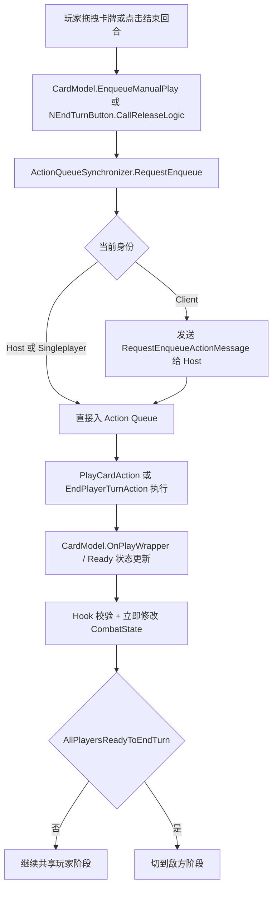
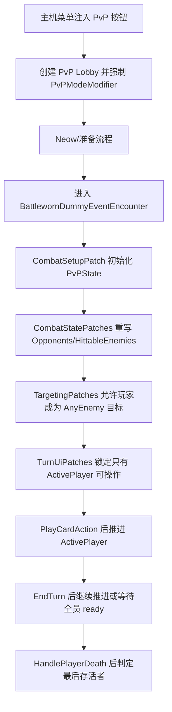
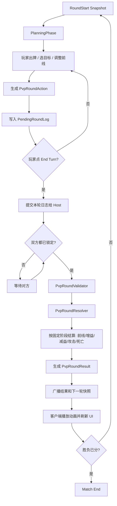

# STS2 PVP 战斗逻辑、现有 PvP Mod 与并行回合制方案分析

更新时间：2026-04-08

## 1. 结论
1. `Slay the Spire 2` 原版多人战斗的底层形态，不是“一人一完整回合”，而是“共享玩家阶段 + 即时结算 + 全员结束回合后再切敌方阶段”。
2. 现有 `Sts2_PVPmod` 不是异步 PvP，也不是并行回合制 PvP；它本质上是“复用原生联机 + 重定向目标集合 + 用 `ActivePlayer` 锁输入权限”的轮流出牌对战。
3. 你前面提出的方案“每个玩家在回合内击靶，结束回合后统一把结果结算到敌方”，从工程和规则稳定性上都明显优于实时 PvP。
4. 如果要做成长期可维护的 PVP 项目，不建议继续在 `Sts2_PVPmod` 上堆 patch；应该新建一层自己的 `PvPRoundState / PvPRoundLog / PvPRoundResolver / PvPRoundSynchronizer`。
5. 你提出的“双方各一个召唤物先承伤/承 buff”的前线机制，是这个模式里最适合作为核心规则的切入点，因为它比实时弹道、即时插队、动态抢目标更容易在现有引擎中落地。

## 2. 本地代码阅读结论
以下部分是代码事实，不是推测。

### 2.1 原版战斗初始化与换边
1. `CombatManager.SetUpCombat` 负责把 `CombatState` 接进战斗、重置玩家、重新填充战斗态、启动 `NetCombatCardDb`、注册生物，然后触发 `CombatSetUp`。
2. 代码位置：`K:\杀戮尖塔mod制作\Tools\sts.dll历史存档\sts2_decompiled20260405\sts2\MegaCrit\sts2\Core\Combat\CombatManager.cs:268`
3. `CombatManager.AllPlayersReadyToEndTurn` 明确要求多人下“全员 ready 且当前侧是 Player”才算可推进。
4. 代码位置：`K:\杀戮尖塔mod制作\Tools\sts.dll历史存档\sts2_decompiled20260405\sts2\MegaCrit\sts2\Core\Combat\CombatManager.cs:681`
5. `CombatManager.SwitchSides` 在普通情况下只在 `Player -> Enemy -> Player` 间切换；切回玩家侧时轮数加一。
6. 代码位置：`K:\杀戮尖塔mod制作\Tools\sts.dll历史存档\sts2_decompiled20260405\sts2\MegaCrit\sts2\Core\Combat\CombatManager.cs:1216`

### 2.2 原版出牌与多人同步
1. 手动出牌不是直接生效，而是先走 `CardModel.EnqueueManualPlay`。
2. `EnqueueManualPlay` 会把 `PlayCardAction` 送进 `RunManager.Instance.ActionQueueSynchronizer.RequestEnqueue(...)`。
3. 代码位置：`K:\杀戮尖塔mod制作\Tools\sts.dll历史存档\sts2_decompiled20260405\sts2\MegaCrit\sts2\Core\Models\CardModel.cs:2171`
4. `ActionQueueSynchronizer.RequestEnqueue` 在客户端下不会直接执行动作，而是发 `RequestEnqueueActionMessage` 给主机；主机或单机才直接入队。
5. 代码位置：`K:\杀戮尖塔mod制作\Tools\sts.dll历史存档\sts2_decompiled20260405\sts2\MegaCrit\sts2\Core\GameActions\Multiplayer\ActionQueueSynchronizer.cs:147`
6. `PlayCardAction.ExecuteAction` 取卡、取目标、检查是否能出、消耗资源，再调 `CardModel.OnPlayWrapper(...)`。
7. 代码位置：`K:\杀戮尖塔mod制作\Tools\sts.dll历史存档\sts2_decompiled20260405\sts2\MegaCrit\sts2\Core\GameActions\PlayCardAction.cs:117`
8. `CardModel.OnPlayWrapper` 会把卡推进 `PlayPile`，经由 Hook 修改结果牌堆/连打次数，再调用 `BeforeCardPlayed -> OnPlay -> AfterCardPlayed` 链条。
9. 代码位置：`K:\杀戮尖塔mod制作\Tools\sts.dll历史存档\sts2_decompiled20260405\sts2\MegaCrit\sts2\Core\Models\CardModel.cs:2224`
10. 这说明原版多人战斗虽然是“多人共享玩家阶段”，但单张卡的效果仍然是即时进入当前战斗态，不存在“先记账、回合末统一结算”的抽象层。

### 2.3 原版目标与出牌许可
1. `CombatState.GetOpponentsOf` 默认直接返回对侧生物列表。
2. `CombatState.HittableEnemies` 默认从 `Enemies` 里筛 `IsHittable`。
3. 代码位置：`K:\杀戮尖塔mod制作\Tools\sts.dll历史存档\sts2_decompiled20260405\sts2\MegaCrit\sts2\Core\Combat\CombatState.cs:390`
4. `CardModel.IsValidTarget` 对 `AnyEnemy` 的默认判断只有一条：`target.Side != this.Owner.Creature.Side`。
5. 代码位置：`K:\杀戮尖塔mod制作\Tools\sts.dll历史存档\sts2_decompiled20260405\sts2\MegaCrit\sts2\Core\Models\CardModel.cs:2140`
6. `Hook.ShouldAllowHitting / ShouldAllowTargeting / ShouldPlay` 会遍历当前 `CombatState` 的 hook listeners，只要有一个 listener 否决，就整体返回 false。
7. 代码位置：
   - `K:\杀戮尖塔mod制作\Tools\sts.dll历史存档\sts2_decompiled20260405\sts2\MegaCrit\sts2\Core\Hooks\Hook.cs:1949`
   - `K:\杀戮尖塔mod制作\Tools\sts.dll历史存档\sts2_decompiled20260405\sts2\MegaCrit\sts2\Core\Hooks\Hook.cs:1988`
   - `K:\杀戮尖塔mod制作\Tools\sts.dll历史存档\sts2_decompiled20260405\sts2\MegaCrit\sts2\Core\Hooks\Hook.cs:2160`
8. 这意味着“前线单位拦截”“玩家互相可选中”“某些目标不可命中”都能通过 patch 目标集合与 hook 闸门实现，而不一定要重写整套卡牌 UI。

### 2.4 原版多人输入权限
1. `NPlayerHand.AreCardActionsAllowed` 默认只会因为 `PlayerActionsDisabled`、额外回合归属、Peek 状态等原因禁手。
2. `NEndTurnButton.CallReleaseLogic` 则会把 `EndPlayerTurnAction / UndoEndPlayerTurnAction` 通过 `ActionQueueSynchronizer` 发进同步队列。
3. 代码位置：
   - `K:\杀戮尖塔mod制作\Tools\sts.dll历史存档\sts2_decompiled20260405\sts2\MegaCrit\sts2\Core\Nodes\Combat\NPlayerHand.cs:709`
   - `K:\杀戮尖塔mod制作\Tools\sts.dll历史存档\sts2_decompiled20260405\sts2\MegaCrit\sts2\Core\Nodes\Combat\NEndTurnButton.cs:337`
4. 这说明原版联机并没有做“严格单活跃玩家”模型；它默认允许多人在玩家阶段各自消耗能量、同时操作，结束回合时再做全员确认。

## 3. `Sts2_PVPmod` 目前是怎么做 PvP 的
以下部分也是代码事实。

### 3.1 状态放在哪里
1. `PvPModeModifier` 用 `[SavedProperty]` 保存 `ActivePlayerNetId / WinnerNetId / MatchEnded / PreparationComplete`。
2. 它还设置了 `ClearsPlayerDeck => true`，并在 `AfterRunCreated` 里重置战斗前状态、把双方生命设到较高值。
3. 代码位置：`K:\Dev\Sts2_PVPmod\Scripts\PvPModeModifier.cs`

### 3.2 PvP 模式怎么进
1. `LobbyPatches` 在多人主机菜单注入一个 PvP 按钮。
2. `PvPRunController.StartHostPvPAsync` 新起一个多人房，并强制把 lobby modifier 锁成 `PvPModeModifier`。
3. 代码位置：
   - `K:\Dev\Sts2_PVPmod\Scripts\Patches\LobbyPatches.cs`
   - `K:\Dev\Sts2_PVPmod\Scripts\PvPRunController.cs:67`

### 3.3 它用什么战斗壳子
1. 它不是自建房间和自建战斗脚本，而是借 `BattlewornDummyEventEncounter` 起战斗房。
2. 进入战斗时把 dummy encounter mutable 后塞进 `CombatRoom`。
3. 代码位置：`K:\Dev\Sts2_PVPmod\Scripts\PvPRunController.cs:284`

### 3.4 它怎么把“打怪”改成“打玩家”
1. `CombatStatePatches` 把 `GetOpponentsOf` 和 `HittableEnemies` 改成返回其他活着的玩家。
2. `TargetingPatches` 让 `CardModel.IsValidTarget` 与 `NTargetManager.AllowedToTargetCreature` 在 `AnyEnemy` 情况下也允许选中别的玩家。
3. 同时它禁止 dummy 被 targeting / hitting。
4. 代码位置：
   - `K:\Dev\Sts2_PVPmod\Scripts\Patches\CombatStatePatches.cs`
   - `K:\Dev\Sts2_PVPmod\Scripts\Patches\TargetingPatches.cs`

### 3.5 它怎么控制轮到谁出牌
1. `PvPState.CanPlayerTakeTurn` 会检查：
   - 当前是否是 PvP 模式
   - 玩家是否活着
   - 当前侧是否为 `Player`
   - `CombatManager.Instance.IsPlayPhase`
   - 这个玩家是不是 `ActivePlayerNetId`
2. `TurnUiPatches` 会把 `NPlayerHand` 和 `NEndTurnButton` 都改成只对当前活跃玩家开放。
3. `TurnControlPatches` 在每次 `PlayCardAction.ExecuteAction` 后推进到下一个活跃玩家。
4. `EndTurnPatches` 在当前活跃玩家点 `End Turn` 后继续推进，直到所有活着的玩家都 ready。
5. 代码位置：
   - `K:\Dev\Sts2_PVPmod\Scripts\PvPState.cs`
   - `K:\Dev\Sts2_PVPmod\Scripts\Patches\TurnUiPatches.cs`
   - `K:\Dev\Sts2_PVPmod\Scripts\Patches\TurnControlPatches.cs`
   - `K:\Dev\Sts2_PVPmod\Scripts\Patches\EndTurnPatches.cs`

### 3.6 它怎么判胜负
1. `WinConditionPatch` 挂在 `CombatManager.HandlePlayerDeath` 后面。
2. 它统计当前还活着的玩家，如果只剩一个，就触发 `PvPRunController.EndMatchAsync(...)`。
3. 如果死的是当前活跃玩家，就把活跃权交给下一个人。
4. 代码位置：`K:\Dev\Sts2_PVPmod\Scripts\Patches\WinConditionPatch.cs`

### 3.7 对这个项目的定性
1. 它没有自建网络协议层。
2. 它没有自建“回合日志”和“统一结算器”。
3. 它没有把原版即时生效动作改成“回合末投递”。
4. 它的本质是：借原生联机和原生战斗房，把“敌人”替换成“其他玩家”，再用 patch 强行加一个 `ActivePlayer` 状态机。

## 4. Web 外部侧证
以下部分用于补充外部上下文；核心判断仍以本地代码为准。

1. Steam 商店页和 PC Gamer 的联机介绍都把 `STS2` 的官方多人模式描述成 co-op，并强调“每个玩家有自己的能量池”“所有玩家都点 `End Turn` 后回合才继续”“有多人专属卡牌”。
2. 这和本地代码里的 `AllPlayersReadyToEndTurn`、`ActionQueueSynchronizer`、`NEndTurnButton` 行为是一致的。
3. PC Gamer 在 2026-02-19 的新闻里也直接引用了官方商店描述，说明上线形态就是最多 4 人 co-op，而不是隐藏的 PvP 模式。
4. GamesRadar 和 PC Gamer 在 2026-04-02 前后的采访稿里提到，Mega Crit 已经在考虑“very competitive”的新模式，以及“用现有系统做新的 multiplayer-like 交互方式”。
5. 这说明 PvP/竞争性模式在产品方向上并不违和，但它目前不是原版现成功能。
6. Destructoid / GamesRadar 转载的开发者表述提到：`STS2` 的 modding 目标是降低摩擦，给 modder 更多资源和更容易下手的入口，而且“可以替换大块代码”。
7. 这意味着从技术路线看，自建一层 PVP 规则核是可行的，不必被现有 BaseLib 或现成 PvP mod 的边界绑死。
8. News Minimalist 对另一个 PvP mod `SlayThePlayer` 的摘要提到：它采用“伤害排队、双方可见、再统一结算”的思路。
9. 这个思路和你现在提出的“回合内击靶、回合末投递”很接近，说明社区里已经有人自然地朝“延迟结算 PvP”方向演化。

## 5. 基于代码与外部资料的推断
从这里开始是设计推断，不是直接代码事实。

1. 原版 `STS2` 已经提供了“多人共享玩家阶段”和“主机权威同步入口”，但没有提供“并行规划回合”的语义层。
2. 现有 `Sts2_PVPmod` 证明了三件事：
   - 玩家可以被纳入目标集合。
   - dummy encounter 可以作为 PvP 外壳。
   - 输入权限可以通过 UI + Hook 联动锁成单活跃玩家。
3. 但它也暴露了边界：
   - 单张卡仍然是即时生效。
   - 目标仍然是当前战斗里的真实对象，而不是“待结算意图”。
   - 活跃玩家状态机会把游戏改造成“轮流出牌”，不是“同时规划”。
4. 因此，如果你的目标是“双方在自己回合里打出一套东西，然后统一结算到对面”，继续堆当前 PvP mod 不是正路。
5. 正路是新增一层“回合日志与统一结算架构”，把原版动作队列从“直接改变战场”改成“记录输入并在锁回合后重放到权威快照”。

## 6. 为什么并行回合制比实时 PvP 更适合你这个项目
1. 它天然削弱先手优势，因为双方在同一个结算窗口提交动作。
2. 它对网络延迟不敏感，因为同步的是“本回合动作日志”，不是持续状态流。
3. 它更贴近 `STS2` 现在的引擎结构，因为你仍然是在“回合、动作队列、结算”范式里工作。
4. 它允许你保留构筑深度，因为你同步的是“行动序列”，不是一句“本回合总伤害 27”。
5. 它也更适合你要做的前线召唤物，因为“前线拦截 / buff 路由 / 溢出规则”都可以写成回合末固定阶段。

## 7. 推荐的规则模型
这是建议方案。

### 7.1 核心单位
1. 每边只有两个核心实体：`Hero` 和 `Frontline`。
2. `Frontline` 默认先承受单体伤害、负面状态、定向攻击。
3. `Hero` 只有在 `Frontline` 死亡、或牌写明“无视前线”时，才可被直接命中。
4. `Frontline` 可以吃 buff，但建议限制为：
   - 不能无限成长
   - 不能无限叠免疫
   - 不能把所有资源都堆成单一胜利点

### 7.2 回合模型
1. `RoundStart`：发牌、回能、持续效果结算、生成本轮快照。
2. `PlanningPhase`：玩家自由出牌，但此时只记录动作，不直接修改对方真实状态。
3. `LockPhase`：玩家点结束回合后锁日志，等待对方也锁。
4. `ResolvePhase`：主机用统一快照和双方日志做权威结算。
5. `RoundEnd`：广播结果、播放动画、做胜负检查、进入下一轮。

### 7.3 结算顺序
建议固定为：

1. 召唤/替换前线
2. 己方自增益与己方资源修正
3. 对敌方施加减益
4. 定向攻击与多段伤害
5. 护盾、格挡、拦截、溢出处理
6. 死亡与濒死触发
7. 回合结束触发

## 8. 逻辑流
下面这一段专门回答“逻辑流是什么”。

1. 开局进入 PvP 房间后，不直接让双方互打，而是建立一个 `PvpMatchState`。
2. `PvpMatchState` 维护每个玩家的 `HeroState / FrontlineState / Hand / Deck / Energy / PendingRoundLog`。
3. 玩家在规划阶段的每个动作，都被规范化成 `PvpRoundAction`。
4. `PvpRoundAction` 不直接对远端实体生效，只改本地预测视图和待提交日志。
5. 当双方都锁定回合后，主机拿“回合开始快照 + 双方日志”进入 `PvpRoundResolver`。
6. `PvpRoundResolver` 按固定阶段依次执行，每一步都只操作权威状态。
7. 结算完成后，主机生成 `PvpRoundResult`。
8. `PvpRoundResult` 再被下发到客户端，用于：
   - 更新真实状态
   - 播放动画
   - 展示本轮伤害/拦截/击杀结果
9. 如果有玩家死亡且满足胜利条件，则切比赛结束；否则开始下一轮。

## 9. 操作流
下面这一段专门回答“玩家和系统怎么操作”。

### 9.1 玩家视角
1. 进入一轮后，玩家看到自己的手牌、能量、前线、本体、敌方预览信息。
2. 玩家出牌时，UI 不直接显示“对方真实血量已减少”，而是显示“本轮待结算结果”。
3. 玩家可以撤销本轮未锁定的操作。
4. 玩家点 `End Turn` 后，本轮输入锁定。
5. 等待对方也锁定。
6. 统一播放本轮结算动画。
7. 进入下一轮。

### 9.2 系统视角
1. 接收本地出牌输入。
2. 校验能量、目标合法性、卡牌合法性。
3. 生成标准化 `PvpRoundAction`。
4. 写入 `PendingRoundLog`。
5. 玩家锁回合时，把日志提交给主机。
6. 主机校验双方日志的合法性与时间戳。
7. 主机进入 `PvpRoundResolver`。
8. 主机广播 `PvpRoundResult`。
9. 客户端刷新 UI 与实体状态。

## 10. 推荐实现架构
这是建议的新项目结构，不是现成仓库的现状。

1. `PvpModeModifier`
   - 保存 match 级别开关、版本号、模式参数。
   - 负责把 run 带进 PvP 模式。

2. `PvpMatchState`
   - 维护整场对战的权威状态。
   - 包含双方英雄、前线、牌组、资源、当前轮次。

3. `PvpRoundState`
   - 只负责当前轮。
   - 包含回合开始快照、双方提交状态、双方待处理日志。

4. `PvpRoundActionLog`
   - 记录每位玩家本轮做过什么。
   - 每条记录都要是可序列化、可校验、可回放的。

5. `PvpRoundValidator`
   - 校验日志是否越权、超费、目标非法、依赖不存在。

6. `PvpRoundResolver`
   - 本项目的核心。
   - 从快照和双方日志生成唯一的 `PvpRoundResult`。

7. `PvpFrontlineRouter`
   - 统一处理“前线拦截”“是否可穿透”“伤害是否溢出本体”。

8. `PvpNetSynchronizer`
   - 不建议直接复用原版“卡一出就生效”的同步语义。
   - 建议仅借原生网络连接与房间入口，自己同步 `RoundLog / RoundResult`。

9. `PvpUiBridge`
   - 把原版手牌、目标 UI、结束回合按钮接到新模式的规则上。
   - 展示“待结算预览”和“结算结果”。

10. `PvpAnimationBridge`
    - 让最终结果看上去仍然像在 `STS2` 里战斗，而不是纯表格结算。

## 11. 为什么不建议直接在 `Sts2_PVPmod` 上继续堆
1. 它的状态机是围绕“当前活跃玩家”写的，不是围绕“双方并行规划回合”写的。
2. 它的目标重写是给当前即时战斗服务的，不是给“回合日志”服务的。
3. 它的胜负判定依赖当前 `CombatState` 下的即时生死，而不是回合末的统一结果。
4. 它的 dummy 壳子适合快速验证 PvP 可行性，但不适合作为长期维护的并行回合制核心。
5. 再往上加，会越来越像 patch 套 patch，而不是完整规则核。

## 12. 卡牌兼容性分层
这一节是为了后续卡牌构筑改造做准备。

### 12.1 可以直接迁移的
1. 自身抽牌
2. 自身回能
3. 自身加格挡
4. 前线召唤/替换
5. 明确目标的单段伤害

### 12.2 需要包装后迁移的
1. `AnyEnemy`
2. `AllEnemies`
3. 多段伤害
4. 随机目标
5. 在“这张牌打出后立刻检查场上状态”的牌

### 12.3 建议首版禁用或重做的
1. 依赖对手即时出牌时机的反制牌
2. 依赖敌方 intent 的牌
3. 依赖当前回合中途插队的牌
4. 连锁触发极多、且强依赖即时战场顺序的牌
5. 原版多人下语义已经容易歧义的卡

## 13. 实施顺序建议
1. 第一阶段：只做 2 人 PvP、1 个前线、10 张测试牌、无随机目标。
2. 第二阶段：做 `RoundLog` 和 `RoundResult`，先让主机权威结算跑通。
3. 第三阶段：做前线拦截、溢出、本体命中规则。
4. 第四阶段：做 buff/debuff、死亡触发、回合末触发。
5. 第五阶段：扩卡池，并建立卡牌兼容性白名单。
6. 第六阶段：再考虑录像回放、观战、异步排行、匹配等外围系统。

## 14. 流程图

### 14.1 原版多人战斗流

### 14.2 现有 `Sts2_PVPmod` 逻辑流

### 14.3 推荐的并行回合制 PvP 架构流

## 15. 最终建议
1. 这个 PVP 项目应该从一开始就定义成“并行回合制 PvP”，不要在实时和轮流出牌之间摇摆。
2. 新项目建议直接自建核心层，不把 `Sts2_PVPmod` 当作底盘，只把它当作“可借鉴 patch 列表”。
3. 优先复用的只有三类东西：
   - 联机房间入口
   - PvP 模式开关与存档字段思路
   - 玩家可被 target / hit 的 patch 切入点
4. 优先重写的有四类东西：
   - 回合状态机
   - 输入日志
   - 统一结算器
   - 结果同步协议
5. 如果后续要进一步做排行榜、录像、观战、异步挑战，这套“回合日志 + 权威结算”的架构也更容易扩展。

## 16. Sources

### 16.1 本地代码
1. `K:\杀戮尖塔mod制作\Tools\sts.dll历史存档\sts2_decompiled20260405\sts2\MegaCrit\sts2\Core\Combat\CombatManager.cs`
2. `K:\杀戮尖塔mod制作\Tools\sts.dll历史存档\sts2_decompiled20260405\sts2\MegaCrit\sts2\Core\Combat\CombatState.cs`
3. `K:\杀戮尖塔mod制作\Tools\sts.dll历史存档\sts2_decompiled20260405\sts2\MegaCrit\sts2\Core\GameActions\PlayCardAction.cs`
4. `K:\杀戮尖塔mod制作\Tools\sts.dll历史存档\sts2_decompiled20260405\sts2\MegaCrit\sts2\Core\GameActions\EndPlayerTurnAction.cs`
5. `K:\杀戮尖塔mod制作\Tools\sts.dll历史存档\sts2_decompiled20260405\sts2\MegaCrit\sts2\Core\GameActions\UndoEndPlayerTurnAction.cs`
6. `K:\杀戮尖塔mod制作\Tools\sts.dll历史存档\sts2_decompiled20260405\sts2\MegaCrit\sts2\Core\GameActions\Multiplayer\ActionQueueSynchronizer.cs`
7. `K:\杀戮尖塔mod制作\Tools\sts.dll历史存档\sts2_decompiled20260405\sts2\MegaCrit\sts2\Core\Hooks\Hook.cs`
8. `K:\杀戮尖塔mod制作\Tools\sts.dll历史存档\sts2_decompiled20260405\sts2\MegaCrit\sts2\Core\Models\CardModel.cs`
9. `K:\杀戮尖塔mod制作\Tools\sts.dll历史存档\sts2_decompiled20260405\sts2\MegaCrit\sts2\Core\Nodes\Combat\NPlayerHand.cs`
10. `K:\杀戮尖塔mod制作\Tools\sts.dll历史存档\sts2_decompiled20260405\sts2\MegaCrit\sts2\Core\Nodes\Combat\NEndTurnButton.cs`
11. `K:\Dev\Sts2_PVPmod\Scripts\PvPModeModifier.cs`
12. `K:\Dev\Sts2_PVPmod\Scripts\PvPState.cs`
13. `K:\Dev\Sts2_PVPmod\Scripts\PvPRunController.cs`
14. `K:\Dev\Sts2_PVPmod\Scripts\Patches\LobbyPatches.cs`
15. `K:\Dev\Sts2_PVPmod\Scripts\Patches\CombatSetupPatch.cs`
16. `K:\Dev\Sts2_PVPmod\Scripts\Patches\CombatStatePatches.cs`
17. `K:\Dev\Sts2_PVPmod\Scripts\Patches\TargetingPatches.cs`
18. `K:\Dev\Sts2_PVPmod\Scripts\Patches\TurnControlPatches.cs`
19. `K:\Dev\Sts2_PVPmod\Scripts\Patches\TurnUiPatches.cs`
20. `K:\Dev\Sts2_PVPmod\Scripts\Patches\EndTurnPatches.cs`
21. `K:\Dev\Sts2_PVPmod\Scripts\Patches\WinConditionPatch.cs`

### 16.2 Web
1. Steam 商店页：<https://store.steampowered.com/app/2868840/Slay_the_Spire_2/>
2. PC Gamer, 2026-02-19, `Surprise: Slay the Spire 2 is bringing 4-player co-op when it hits early access on March 6`  
   <https://www.pcgamer.com/games/card-games/surprise-slay-the-spire-2-is-bringing-4-player-co-op-when-it-hits-early-access-on-march-6/>
3. PC Gamer, 2026-03-25, `How multiplayer works in Slay the Spire 2`  
   <https://www.pcgamer.com/games/roguelike/slay-the-spire-2-multiplayer-co-op/>
4. GamesRadar, 2026-04-02, `Slay the Spire 2 dev teases 3 new modes ... very competitive ... a new multiplayer setting`  
   <https://www.gamesradar.com/games/roguelike/slay-the-spire-2-dev-teases-3-new-modes-something-very-competitive-one-for-players-who-dont-have-the-time-for-the-slay-the-spire-experience-and-a-new-multiplayer-setting/>
5. Destructoid 访谈转载摘要，2026-03-08 附近，关于 easier modding / reducing friction  
   <https://www.gamesradar.com/games/roguelike/slay-the-spire-2-devs-are-microtransaction-haters-even-if-some-fans-threaten-to-buy-all-and-any-cosmetics-we-may-ever-release/>
6. News Minimalist 对 `SlayThePlayer` 的摘要，2026-03-25  
   <https://www.newsminimalist.com/articles/slay-the-spire-2-mod-adds-player-versus-player-combat-to-co-op-runs-5e33ff4c>

备注：Web 部分主要用于补产品方向和社区方案侧证；架构判断仍以本地代码为主。
