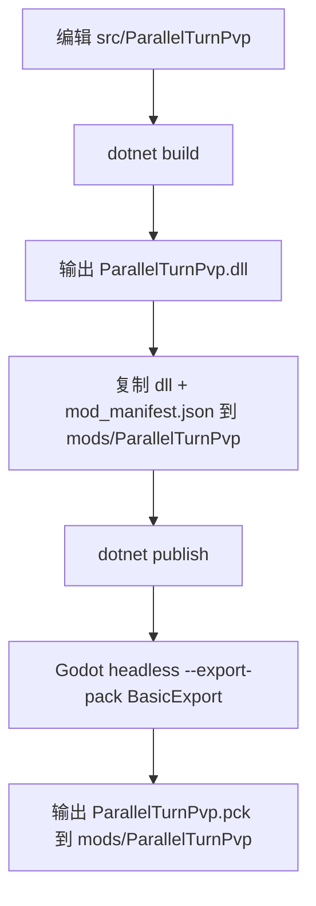
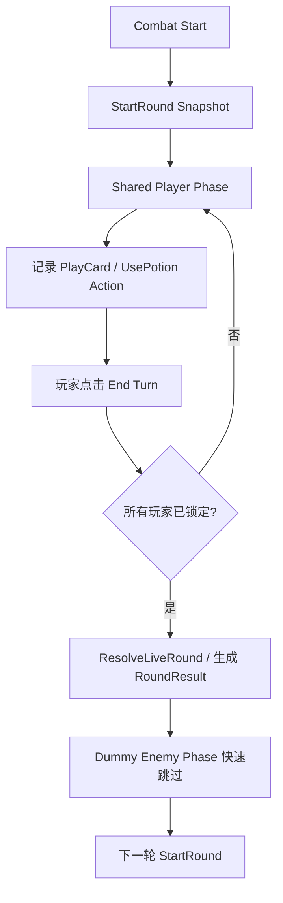
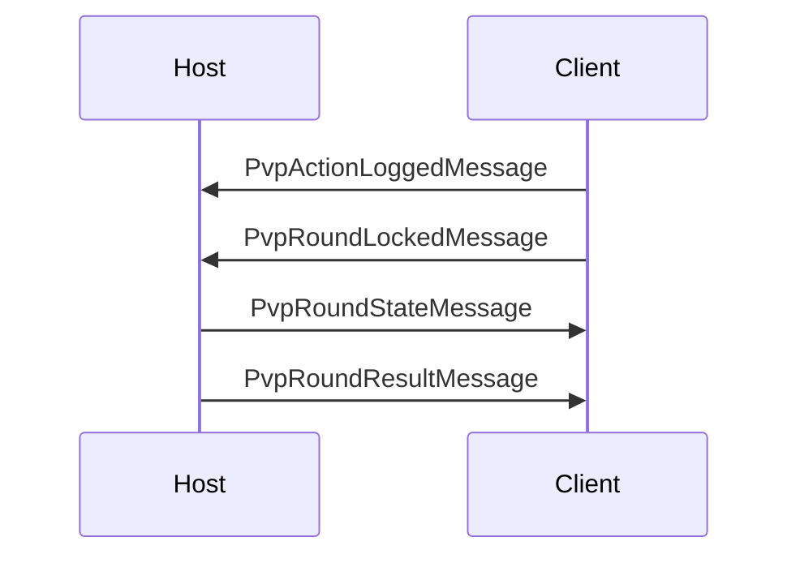

# ParallelTurnPvp v0 执行计划

## 1. 目标
1. 在 `K:\杀戮尖塔mod制作\STS2_mod\PVP_ParallelTurn\src\ParallelTurnPvp` 建立独立 Godot/.NET 9 工程。
2. 产出 `ParallelTurnPvp.dll + ParallelTurnPvp.pck + mod_manifest.json` 到 `K:\SteamLibrary\steamapps\common\Slay the Spire 2\mods\ParallelTurnPvp`。
3. 首版模式为 `ParallelTurnPvP_Debug`：2 人联机、固定 Debug Arena、Necrobinder/Osty 前线、白名单卡牌/药水/遗物。
4. 运行时不依赖 `BaseLib / MinionLib / RitsuLib / Forked Road`，仅引用 `sts2.dll` 与 `0Harmony.dll`。

## 2. 验收口径
1. `dotnet build` 成功并自动复制 `dll + manifest`。
2. `dotnet publish` 成功并调用 Godot headless 导出 `.pck`。
3. 游戏能识别 `ParallelTurnPvp`，无缺失程序集、无 `class not found`、无 manifest 解析错误。
4. 多人 Host/Client 可以通过 Debug 入口进入 PvP Arena。
5. 双方固定测试白名单内容可正常发牌、出牌、喝药、结束回合并完成一轮结算。

## 3. 可借鉴清单
### MinionLib
1. `Guardian` 承伤与未格挡溢出规则。
2. 显式 `Front/Back` 站位概念。
3. 自定义目标类型抽象。
4. 召唤入口与视觉挂点组织方式。

### Forked Road
1. 显式 runtime 分层：`Run -> Round -> Player`。
2. 屏障式推进：所有参与者锁定后推进下一阶段。
3. 自定义 `INetMessage` 结构与消息注册方式。
4. 只读观察/等待界面的结构思路。
5. save/restore 的 sidecar snapshot 思路。

### 原版 Osty / Necrobinder
1. `PlayerCombatState.Pets` 生命周期路径。
2. `OstyCmd.Summon` 的召唤/复活时机。
3. `BoundPhylactery` 的开战自动召唤入口。
4. `Poke` / `Afterlife` 的随从交互语义。

## 4. 架构分层
1. `Bootstrap`：Lobby 入口、Neow 准备流程、固定 Arena 启动。
2. `Models`：Debug Modifier、自定义卡牌、药水、遗物。
3. `Core`：`PvpMatchRuntime / PvpRoundState / PvpActionLog / PvpRoundResolver / PvpSyncBridge`。
4. `Patches`：联机入口、目标重定向、前线拦截、回合日志追踪。
5. `ParallelTurnPvp/localization`：英中双语文本。

## 5. 实施阶段
1. 文档归档与执行计划落盘。
2. Godot/.NET 工程脚手架、路径发现、构建导出链。
3. PvP runtime 类型、白名单与前线辅助层。
4. Debug modifier、自定义内容、Neow 准备逻辑。
5. Combat/Lobby patch 与回合日志跟踪。
6. `build / publish / artifact` 验证。

## 6. 测试矩阵
| 类别 | 检查项 | 预期 |
|---|---|---|
| 环境 | Godot 4.5.1 Mono | 可执行 |
| 环境 | `dotnet --version` | 9.x |
| 构建 | `dotnet build` | 成功，复制 dll + manifest |
| 导出 | `dotnet publish` | 成功，导出 pck |
| 加载 | 游戏识别 mod | 成功 |
| 联机 | Host/Client 同版本 | 可进入 Debug Arena |
| 玩法 | 白名单内容 | 可用 |
| 前线 | Hero 受击前先吃 Osty | 成立 |
| 失败场景 | 版本/协议不一致 | 拒绝进入 |

## 7. 设计定版
1. 有限意图与并行回合设计已单独归档到 [有限意图与并行回合设计定版.md](K:\杀戮尖塔mod制作\STS2_mod\PVP_ParallelTurn\analysis\有限意图与并行回合设计定版.md)。
2. 当前锁定规则：
   - 动作大类公开
   - 每打出 1 张牌解锁 1 格对方意图
   - 只公开对方回合开始时能量
   - 结束回合不可撤销
   - 最早结束回合者回复 `3` 点生命
   - 目标只公开 `Self/Enemy` 侧
## 8. 流程图
### 8.1 构建导出流

### 8.2 回合流

### 8.3 Host/Client 消息流

