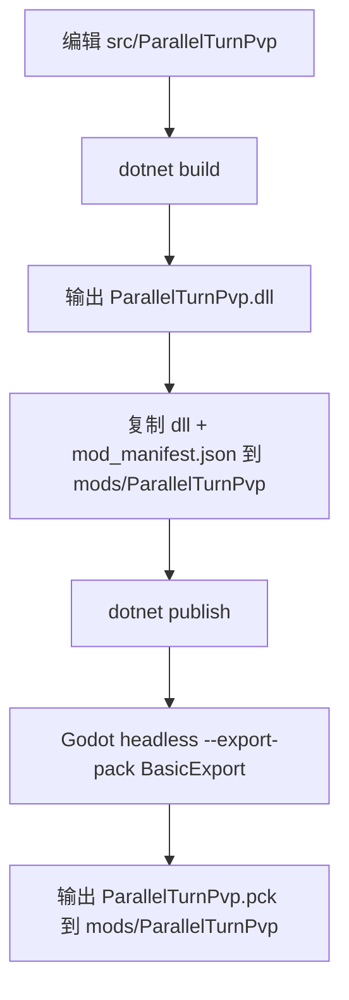
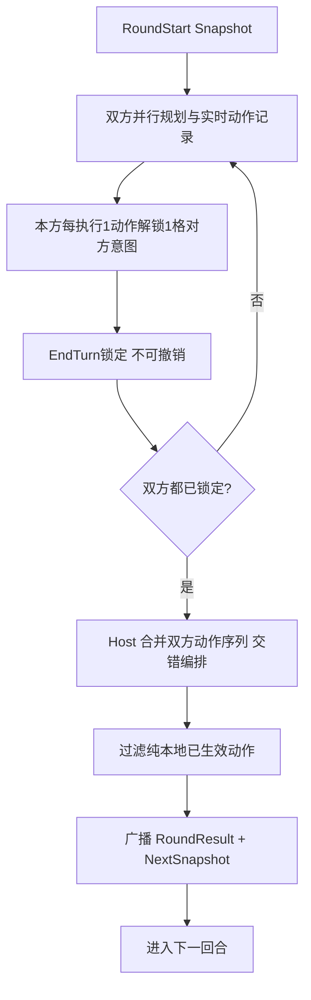
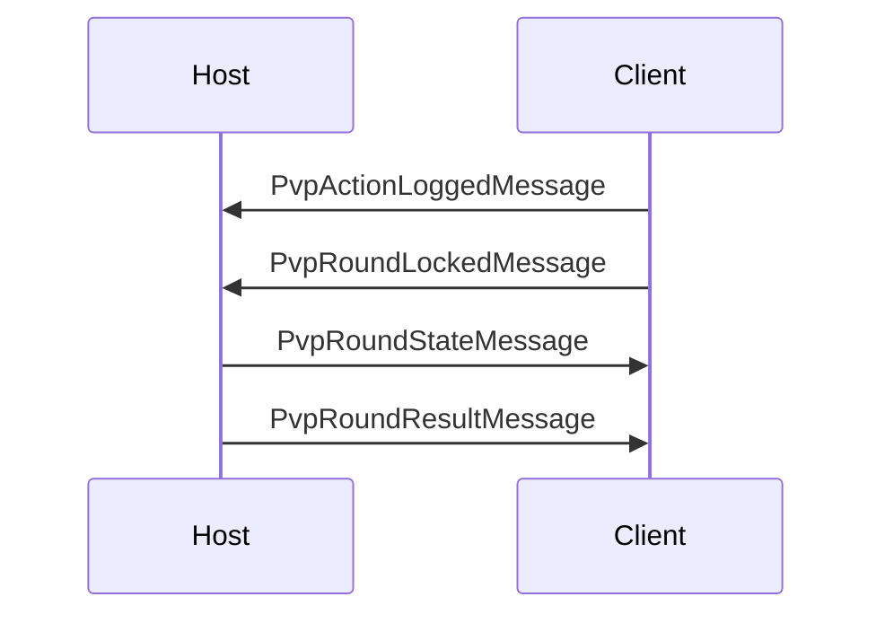

# ParallelTurnPvp v0 执行计划

## 1. 目标
1. 在 `K:\杀戮尖塔mod制作\STS2_mod\PVP_ParallelTurn\src\ParallelTurnPvp` 建立独立 Godot/.NET 9 工程。
2. 产出 `ParallelTurnPvp.dll + ParallelTurnPvp.pck + mod_manifest.json` 到 `K:\SteamLibrary\steamapps\common\Slay the Spire 2\mods\ParallelTurnPvp`。
3. 首版模式为 `ParallelTurnPvP_Debug`：2 人联机、固定 Debug Arena、Necrobinder/Osty 前线、白名单卡牌/药水/遗物。
4. 运行时不依赖 `BaseLib / MinionLib / RitsuLib / Forked Road`，仅引用 `sts2.dll` 与 `0Harmony.dll`。

## 2. 验收口径
1. `dotnet build` 成功并自动复制 `dll + manifest`。
2. `dotnet publish` 成功并调用 Godot headless 导出 `.pck`。
3. 游戏能识别 `ParallelTurnPvp`，无缺失程序集、无 `class not found`、无 manifest 解析错误。
4. 多人 Host/Client 可以通过 Debug 入口进入 PvP Arena。
5. 双方固定测试白名单内容可正常发牌、出牌、喝药、结束回合并完成一轮结算。

## 3. 可借鉴清单
### MinionLib
1. `Guardian` 承伤与未格挡溢出规则。
2. 显式 `Front/Back` 站位概念。
3. 自定义目标类型抽象。
4. 召唤入口与视觉挂点组织方式。

### Forked Road
1. 显式 runtime 分层：`Run -> Round -> Player`。
2. 屏障式推进：所有参与者锁定后推进下一阶段。
3. 自定义 `INetMessage` 结构与消息注册方式。
4. 只读观察/等待界面的结构思路。
5. save/restore 的 sidecar snapshot 思路。

### 原版 Osty / Necrobinder
1. `PlayerCombatState.Pets` 生命周期路径。
2. `OstyCmd.Summon` 的召唤/复活时机。
3. `BoundPhylactery` 的开战自动召唤入口。
4. `Poke` / `Afterlife` 的随从交互语义。

## 4. 架构分层
1. `Bootstrap`：Lobby 入口、Neow 准备流程、固定 Arena 启动。
2. `Models`：Debug Modifier、自定义卡牌、药水、遗物。
3. `Core`：`PvpMatchRuntime / PvpRoundState / PvpActionLog / PvpRoundResolver / PvpSyncBridge`。
4. `Patches`：联机入口、目标重定向、前线拦截、回合日志追踪。
5. `ParallelTurnPvp/localization`：英中双语文本。

## 5. 实施阶段（当前主线）
1. 战斗主线收敛：默认走同场对战，不再以“正式分房”作为当前里程碑；保留分房方案为后续可选路线。
2. 目标系统收敛：攻击牌/攻击药水支持直接选敌方 `Hero/Frontline`，并继续遵守前线承伤与溢出规则。
3. 有限意图实时化：本方“已执行动作数（牌+药水）”实时映射可见对方意图条目数；仅公开对方回合起始能量。
4. Host 权威交错结算：双方锁回合后，Host 按“交错规则合并”生成单一结算序列并广播权威结果。
5. 结算表现层：仅回放“对敌方或公共状态产生影响”的动作；纯本地且已在规划期生效的动作不重复播放效果动画。
6. 重连一致性：重连后先回灌权威快照（血量/格挡/手牌/前线状态/回合索引），再恢复可操作。
7. 回归与发布：每轮构建后覆盖双机，跑固定用例并更新 `analysis/CHANGELOG.md` 与待办清单状态。

## 6. 测试矩阵
| 类别 | 检查项 | 预期 |
|---|---|---|
| 环境 | Godot 4.5.1 Mono | 可执行 |
| 环境 | `dotnet --version` | 9.x |
| 构建 | `dotnet build` | 成功，复制 dll + manifest |
| 导出 | `dotnet publish` | 成功，导出 pck |
| 加载 | 游戏识别 mod | 成功 |
| 联机 | Host/Client 同版本 | 可进入 Debug Arena |
| 玩法 | 白名单内容 | 可用 |
| 前线 | Hero 受击前先吃 Osty | 成立 |
| 失败场景 | 版本/协议不一致 | 拒绝进入 |

## 7. 设计定版
1. 有限意图与并行回合设计已单独归档到 [有限意图与并行回合设计定版.md](K:\杀戮尖塔mod制作\STS2_mod\PVP_ParallelTurn\analysis\有限意图与并行回合设计定版.md)。
2. 当前锁定规则：
   - 动作大类公开
   - 每打出 1 张牌解锁 1 格对方意图
   - 只公开对方回合开始时能量
   - 结束回合不可撤销
   - 最早结束回合者回复 `3` 点生命
   - 目标只公开 `Self/Enemy` 侧
   - 结算采用双方动作日志“交错规则合并”（Host 权威）
   - 纯本地即时效果（如仅影响自身手牌/抽牌且已生效）不进入回合末效果回放

## 8. 当前执行步骤（按序推进）
1. `Step 1`：稳定同场回合推进与锁回合同步，清空“无法过回合/卡回合”遗留问题。
2. `Step 2`：完善目标选择与前线拦截，确保 `Hero/Frontline` 显式选目标在双端一致。
3. `Step 3`：接入实时有限意图可见度（动作数驱动）并修复客户端意图刷新时机。
4. `Step 4`：落地 Host 交错结算编排器（排序、去重、幂等、版本守卫）。
5. `Step 5`：落地结算动画过滤器（仅敌方/公共影响动作进入播放队列）。
6. `Step 6`：重连恢复链路收口（恢复后首回合同步、状态不回满、不回滚）。
7. `Step 7`：双机回归 + torelease 产物归档，形成可回滚测试基线。

## 9. 流程图
### 9.1 构建导出流

### 9.2 回合流（同场 + 交错结算）

### 9.3 Host/Client 消息流

